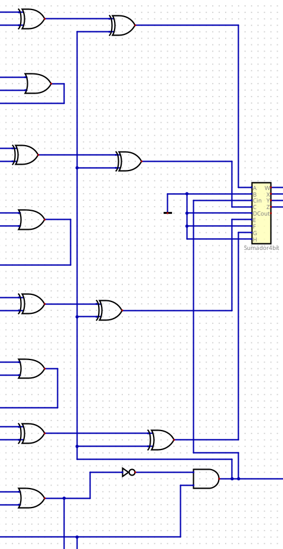
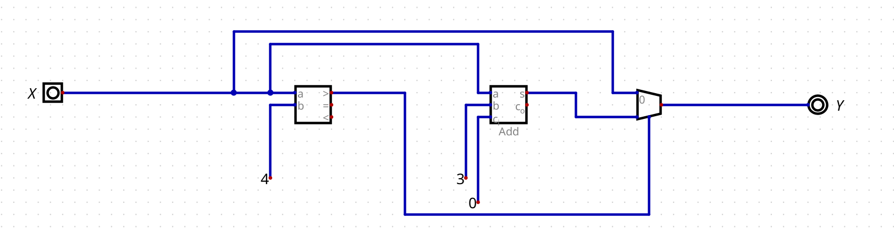
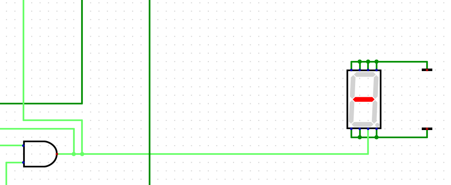
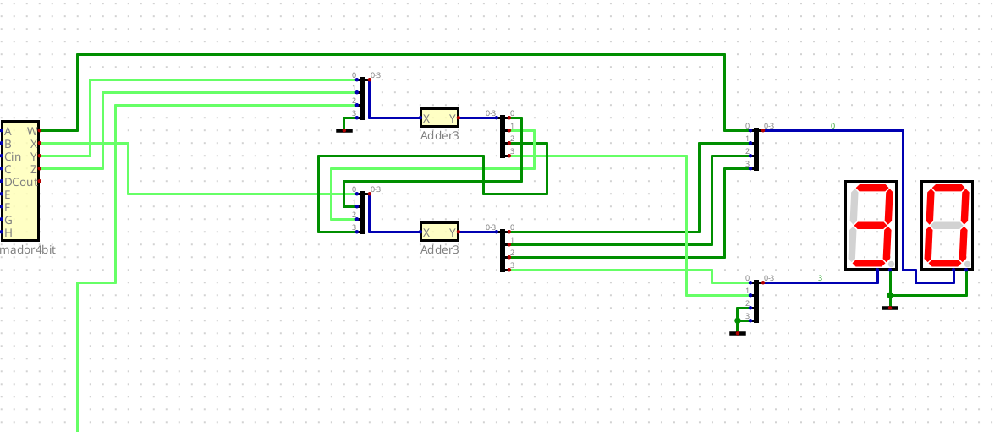
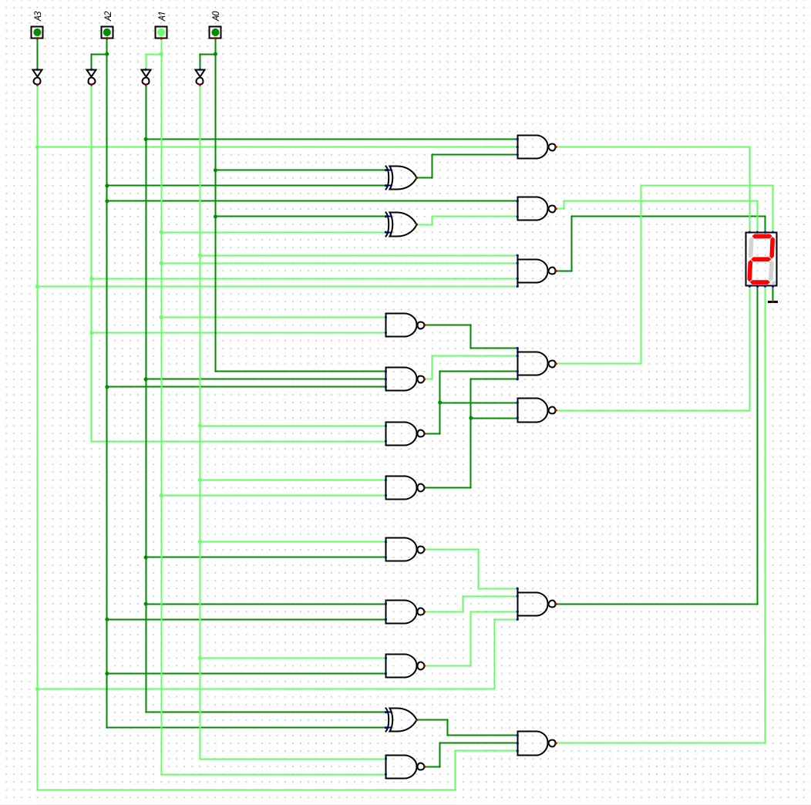

# Laboratorio 3: Visualización de Resultados en Displays de 7 Segmentos

**Asignatura:** Electrónica Digital  
**Institución:** Universidad Nacional de Colombia  
**Autores:** Valentina Carreño Granados - Ramón de Jesús Arias Arrieta - Nayib Alberto Soñeth Mercado  

> **Resumen (Abstract):**  
> [Escribe aquí un breve resumen sobre los objetivos del laboratorio y los resultados obtenidos]

---

## Tabla de Contenidos
1. [Sumador / Restador](#1-sumador--restador)
2. [Cálculo de Magnitud](#2-cálculo-de-magnitud)
3. [Conversor Binario a BCD](#3-conversor-binario-a-bcd)
4. [Display de Signo](#4-display-de-signo)
5. [Decodificador BCD a 7 Segmentos](#5-decodificador-bcd-a-7-segmentos)

---

## 1. Sumador / Restador

### A. Código del Módulo
```verilog
/*
 * Generated by Digital. Don't modify this file!
 * Any changes will be lost if this file is regenerated.
 */

module Sumres (
  input  A0,
    input  A1,
    input  A2,
    input  A3,

    input  B0,
    input  B1,
    input  B2,
    input  B3,

    input  Sel,

    output S0,
    output S1,
    output S2,
    output S3,
    output Cout
);
    wire B0_int;
    wire B1_int;
    wire B2_int;
    wire B3_int;

    assign B0_int = ~B0;
    assign B1_int = ~B1;
    assign B2_int = ~B2;
    assign B3_int = ~B3;

    wire s4;
    wire s5;
    wire s6;

    wire s7;
    wire s8;
    wire s9;

    wire s10;
    wire s11;
    wire s12;

    wire s13;
    wire s14;

    assign s4  = (B0_int ^ Sel);
    assign s7  = (B1_int ^ Sel);
    assign s10 = (B2_int ^ Sel);
    assign s13 = (B3_int ^ Sel);
    assign s5 = (A0 ^ s4);
    assign S0 = (s5 ^ Sel);
    assign s6 = ((s5 & Sel) | (A0 & s4));
    assign s8 = (A1 ^ s7);
    assign S1 = (s8 ^ s6);
    assign s9 = ((s8 & s6) | (A1 & s7));
    assign s11 = (A2 ^ s10);
    assign S2 = (s11 ^ s9);
    assign s12 = ((s11 & s9) | (A2 & s10));
    assign s14 = (A3 ^ s13);
    assign S3 = (s14 ^ s12);
    assign Cout = ((s14 & s12) | (A3 & s13));

endmodule
```
#### B. Diagrama comportamental Nivel compuertas lógicas 


## 2. Cálculo de Magnitud
#### A. Diagrama


## 3. Conversor Binario a BCD
#### A. Diagrama


#### B. Código
```verilog
/*
 * Generated by Digital. Don't modify this file!
 * Any changes will be lost if this file is regenerated.
 */

module CompUnsigned #(
    parameter Bits = 1
)
(
    input [(Bits -1):0] a,
    input [(Bits -1):0] b,
    output \> ,
    output \= ,
    output \<
);
    assign \> = a > b;
    assign \= = a == b;
    assign \< = a < b;
endmodule

module DIG_Add
#(
    parameter Bits = 1
)
(
    input [(Bits-1):0] a,
    input [(Bits-1):0] b,
    input c_i,
    output [(Bits - 1):0] s,
    output c_o
);
   wire [Bits:0] temp;

   assign temp = a + b + c_i;
   assign s = temp [(Bits-1):0];
   assign c_o = temp[Bits];
endmodule


module Mux_2x1_NBits #(
    parameter Bits = 2
)
(
    input [0:0] sel,
    input [(Bits - 1):0] in_0,
    input [(Bits - 1):0] in_1,
    output reg [(Bits - 1):0] out
);
    always @ (*) begin
        case (sel)
            1'h0: out = in_0;
            1'h1: out = in_1;
            default:
                out = 'h0;
        endcase
    end
endmodule


module Adder3 (
  input [3:0] X,
  output [3:0] Y
);
  wire s0;
  wire [3:0] s1;
  CompUnsigned #(
    .Bits(4)
  )
  CompUnsigned_i0 (
    .a( X ),
    .b( 4'b100 ),
    .\> ( s0 )
  );
  DIG_Add #(
    .Bits(4)
  )
  DIG_Add_i1 (
    .a( X ),
    .b( 4'b11 ),
    .c_i( 1'b0 ),
    .s( s1 )
  );
  Mux_2x1_NBits #(
    .Bits(4)
  )
  Mux_2x1_NBits_i2 (
    .sel( s0 ),
    .in_0( X ),
    .in_1( s1 ),
    .out( Y )
  );
endmodule
```
## 4. Display de Signo
#### A. Diagrama


## 5. Decodificador BCD a 7 Segmentos
#### A. Diagrama



## :mag: Detalle decodificador BCD a 7 segmentos 




