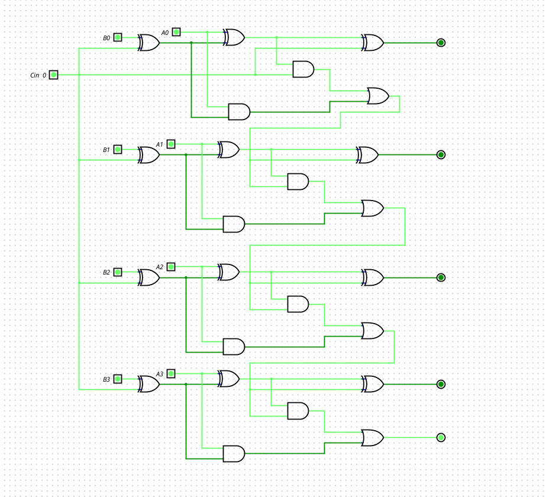

# Laboratorio 3: Visualización de Resultados en Displays de 7 Segmentos

**Asignatura:** Electrónica Digital  
**Institución:** Universidad Nacional de Colombia  
**Autores:** Valentina Carreño Granados - Ramón de Jesús Arias Arrieta - Nayib Alberto Soñeth Mercado  

> **Resumen (Abstract):**  
> [Escribe aquí un breve resumen sobre los objetivos del laboratorio y los resultados obtenidos]

---

## Tabla de Contenidos
1. [Sumador / Restador](#1-sumador--restador)
2. [Cálculo de Magnitud](#2-cálculo-de-magnitud)
3. [Conversor Binario a BCD](#3-conversor-binario-a-bcd)
4. [Display de Signo](#4-display-de-signo)
5. [Decodificador BCD a 7 Segmentos](#5-decodificador-bcd-a-7-segmentos)

---

## 1. Sumador / Restador

### A. Código del Módulo
```verilog
/*
 * Generated by Digital. Don't modify this file!
 * Any changes will be lost if this file is regenerated.
 */

module Sumres (
  input  A0,
    input  A1,
    input  A2,
    input  A3,

    input  B0,
    input  B1,
    input  B2,
    input  B3,

    input  Sel,

    output S0,
    output S1,
    output S2,
    output S3,
    output Cout
);
    wire B0_int;
    wire B1_int;
    wire B2_int;
    wire B3_int;

    assign B0_int = ~B0;
    assign B1_int = ~B1;
    assign B2_int = ~B2;
    assign B3_int = ~B3;

    wire s4;
    wire s5;
    wire s6;

    wire s7;
    wire s8;
    wire s9;

    wire s10;
    wire s11;
    wire s12;

    wire s13;
    wire s14;

    assign s4  = (B0_int ^ Sel);
    assign s7  = (B1_int ^ Sel);
    assign s10 = (B2_int ^ Sel);
    assign s13 = (B3_int ^ Sel);
    assign s5 = (A0 ^ s4);
    assign S0 = (s5 ^ Sel);
    assign s6 = ((s5 & Sel) | (A0 & s4));
    assign s8 = (A1 ^ s7);
    assign S1 = (s8 ^ s6);
    assign s9 = ((s8 & s6) | (A1 & s7));
    assign s11 = (A2 ^ s10);
    assign S2 = (s11 ^ s9);
    assign s12 = ((s11 & s9) | (A2 & s10));
    assign s14 = (A3 ^ s13);
    assign S3 = (s14 ^ s12);
    assign Cout = ((s14 & s12) | (A3 & s13));

endmodule
```
#### B. Diagrama comportamental Nivel compuertas lógiccas 



## 2. Cálculo de Magnitud


## 3. Conversor Binario a BCD


## 4. Display de Signo


## 5. Decodificador BCD a 7 Segmentos

