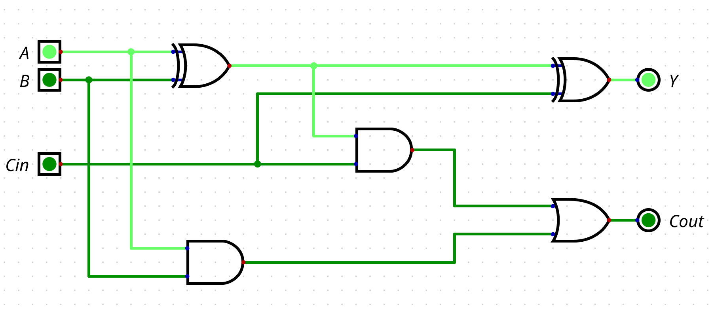
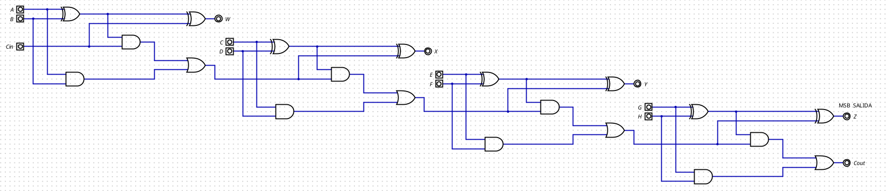
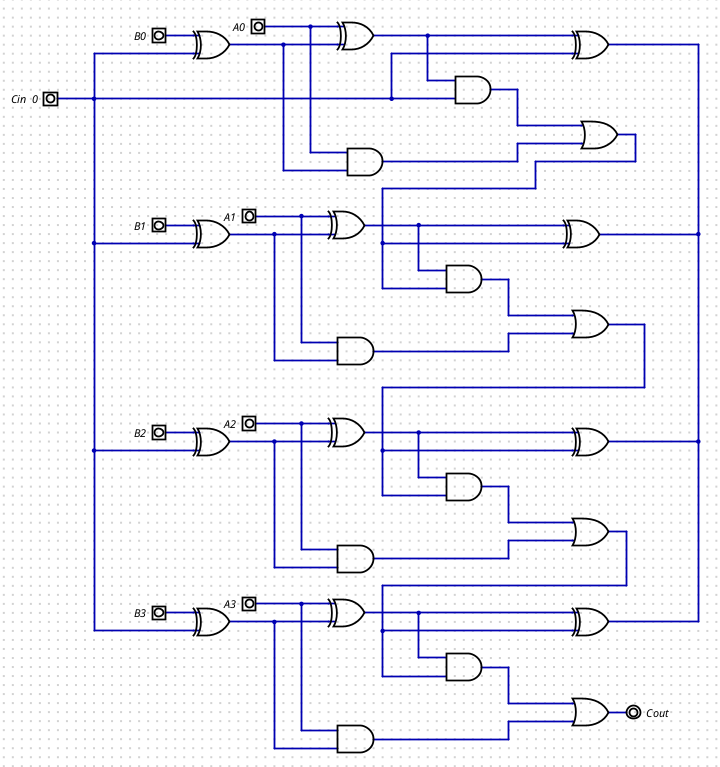

# Laboratorio 2: Diseño y Simulación de Circuitos Sumadores y Restadores
**Asignatura:** Electrónica Digital  
**Institución:** Universidad Nacional de Colombia
**Autores:** Valentina Carreño Granados - Ramón de Jesus Arias Arrieta - Nayib


> **Resumen (Abstract):** Este informe/laboratorio presenta el diseño, implementación en HDL y simulación de circuitos aritméticos combinacionales. En la Parte A se aborda el desarrollo incremental desde un sumador de 1 bit hasta un sumador de 4 bits. En la Parte B se presenta el diseño de un sumador/restador parametrizado y la resolución de un reto de diseño aritmético complementario.

---

## 📄 Tabla de Contenidos
1. [Parte A: Circuitos Sumadores](#-parte-a-circuitos-sumadores)
   - [1. Sumador Completo de 1 Bit](#1-sumador-completo-de-1-bit)
   - [2. Sumador de 4 Bits](#2-sumador-de-4-bits)
2. [Parte B: Sumador / Restador y Reto de Diseño](#-parte-b-sumador--restador-y-reto-de-diseño)
   - [1. Circuitos Sumador / Restador](#1-circuito-sumador--restador)
   - [2. Reto de Diseño](#2-reto-de-diseño)
3. [Conclusiones](#-conclusiones)

---

## 🔬 Parte A: Circuitos Sumadores

### 1. Sumador Completo de 1 Bit

#### A. Código del Módulo
```verilog
/*
 * Generated by Digital. Don't modify this file!
 * Any changes will be lost if this file is regenerated.
 */

module sumador_1_bbit (
  input A,
  input B,
  input Cin,
  output Y,
  output Cout
);
  wire s0;
  assign s0 = (A ^ B);
  assign Y = (s0 ^ Cin);
  assign Cout = ((s0 & Cin) | (A & B));
endmodule/*
 * Generated by Digital. Don't modify this file!
 * Any changes will be lost if this file is regenerated.
 */

module Sumador4bits (
  input A,
  input B,
  input Cin,
  input C,
  input D,
  input E,
  input F,
  input G,
  input H,
  output W,
  output X,
  output Y,
  output Z,
  output Cout
);
  wire s0;
  wire s1;
  wire s2;
  wire s3;
  wire s4;
  wire s5;
  wire s6;
  assign s0 = (A ^ B);
  assign s2 = (C ^ D);
  assign s4 = (E ^ F);
  assign s6 = (G ^ H);
  assign W = (s0 ^ Cin);
  assign s1 = ((s0 & Cin) | (A & B));
  assign X = (s2 ^ s1);
  assign s3 = ((s2 & s1) | (C & D));
  assign Y = (s4 ^ s3);
  assign s5 = ((s4 & s3) | (E & F));
  assign Z = (s6 ^ s5);
  assign Cout = ((s6 & s5) | (G & H));
endmodule
```
#### B. Diagrama comportamental Nivel compuertas lógiccas 



### 2. Sumador de 4 bits

#### A. Código del módulo 
```verilog
/*
 * Generated by Digital. Don't modify this file!
 * Any changes will be lost if this file is regenerated.
 */

module Sumador4bits (
  input A,
  input B,
  input Cin,
  input C,
  input D,
  input E,
  input F,
  input G,
  input H,
  output W,
  output X,
  output Y,
  output Z,
  output Cout
);
  wire s0;
  wire s1;
  wire s2;
  wire s3;
  wire s4;
  wire s5;
  wire s6;
  assign s0 = (A ^ B);
  assign s2 = (C ^ D);
  assign s4 = (E ^ F);
  assign s6 = (G ^ H);
  assign W = (s0 ^ Cin);
  assign s1 = ((s0 & Cin) | (A & B));
  assign X = (s2 ^ s1);
  assign s3 = ((s2 & s1) | (C & D));
  assign Y = (s4 ^ s3);
  assign s5 = ((s4 & s3) | (E & F));
  assign Z = (s6 ^ s5);
  assign Cout = ((s6 & s5) | (G & H));
endmodule
```


#### B. Diagrama comportamental Nivel compuertas lógiccas 



---

### 🔬 Parte B

### 1. Sumador restador

#### A. Código del Módulo original 
```verilog
/*
 * Generated by Digital. Don't modify this file!
 * Any changes will be lost if this file is regenerated.
 */

module Sumador4bits (
  input A,
  input B,
  input Cin,
  input C,
  input D,
  input E,
  input F,
  input G,
  input H,
  output W,
  output X,
  output Y,
  output Z,
  output Cout
);
  wire s0;
  wire s1;
  wire s2;
  wire s3;
  wire s4;
  wire s5;
  wire s6;
  assign s0 = (A ^ B);
  assign s2 = (C ^ D);
  assign s4 = (E ^ F);
  assign s6 = (G ^ H);
  assign W = (s0 ^ Cin);
  assign s1 = ((s0 & Cin) | (A & B));
  assign X = (s2 ^ s1);
  assign s3 = ((s2 & s1) | (C & D));
  assign Y = (s4 ^ s3);
  assign s5 = ((s4 & s3) | (E & F));
  assign Z = (s6 ^ s5);
  assign Cout = ((s6 & s5) | (G & H));
endmodule
```
#### B. Diagrama comportamental Nivel compuertas lógiccas 



